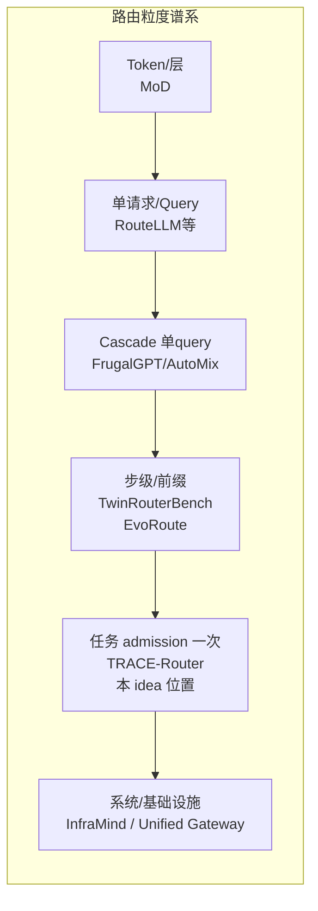

# 长程 Agent 任务级成本感知模型路由：文献与方法深度调研

> Generated 2026-09-15 · depth: deep · 检索覆盖 arXiv/会议页/官方仓库/厂商一手页 · workspace: research/task-level-cost-routing/
> 证据分级约定：**[论文写明]** = 原文可直接引用；**[推断]** = 基于多篇原文的综合判断；**[厂商]** = 非同行评审一手测量。

---

## 一页结论（先读这里）

**1. 值不值得继续做？值得，但必须换主线。**  
“单次更贵的模型在 Agent 任务上 $/success 可能更低”作为**中心发现**的学术优先权风险高：相关运行时路由、级联升级、任务级 bandit 在 2025–2026 已经很挤（SWE-Router、TACIT-Switch、TRACE-Router、TwinRouterBench、Budget-Aware Agentic Routing 等）[1–8]。真正仍空着的是三要素同时满足：

> **(a) 任务 admission 时（k=0，尚未执行）**  
> **(b) 对每个 (模型 × 推理档位) 联合预测 (P_success, E[#calls], E[tokens], E[$], 质量)**  
> **(c) 在质量约束下选择预计总费用最低配置**

F7 用 8 组精确短语检索 + 7 篇最近邻方法节精读交叉验证：**没有一篇同时满足 (a)(b)(c)** [推断，高置信]。最近组合是 TRACE 的粒度 + ZIP-RC 的“成功×成本联合分布”思想 + TwinRouterBench 的 failure-aware 记账 [1,2,9]。

**2. 最大新意风险**：审稿人会认为“把难度、价格、调用次数放进一个公式”是自然工程组合——这个批评**部分正确**。单独的路由算法或单独的成本公式都不够新；必须把贡献钉在 **ex-ante 多目标联合预测 + 受约束选择 + 成本反转的可重复测量协议**，并用 RouteGuard/Task-Level 混评要求的对照证明增益不是 tier 组成效应 [10,11]。

**3. 最大方法风险**：事前 token 预测上限很低——同任务多次执行 token 可差 **30×**，前沿模型自预测相关最高约 **0.39** 且系统性低估 [12]；预算区间覆盖率在强训练后仍封顶约 **47%** [13]。预测器必须输出**分布/分位数**，决策必须对预测误差鲁棒，否则“预测总成本再选模”会被在线 bandit（TRACE）以更简单方式打败。

**4. 最大数据/实验风险**：公开 Agent 轨迹**普遍没有**一等公民的 token/$ 字段 [推断，F5]；必须自建日志层。多模型 × 多档位 × 任务级重放的 API 费用会迅速膨胀；SWE-bench 原版评分噪声大，Verified 污染已有证据 [14,15]。成本反转若只在 1–2 个模型对、单一价格表上出现，会被视为案例故事。

**5. 推荐论文主线（不是“又一个路由器”）**：

> **测量 + 事前预测 + 受约束路由**  
> ① 在长程 Agent 基准上系统测量「单次标价排序 vs 任务级 $/success 排序」的反转率（附 CI）；  
> ② 训练 admission-time 多目标预测器（成功 + 调用数 + token + 费用，输出分布）；  
> ③ 质量约束下选择 (model × effort)，对照 always-strong/cheapest、TRACE 式 bandit、步级路由与 share-matched 盲分配；  
> ④ 消融证明每个信号有独立价值，并报告误差敏感性。

**6. 应删除或延后**：第一版不做 KV-cache 联合优化（与 Unified AI Gateway 主场重叠且范围爆炸）[16]；不做多 Agent 拓扑搜索；不以 RL 为主方法；动态 handoff / 失败升级作为第二阶段扩展，不进第一版主张。

**7. 最小论文版本实验**：SWE-bench Verified（或 SWE-Gym 子集）+ Terminal-Bench-core；≥4 模型 × ≥2 effort；全量或分层重放记账；反转率 + bootstrap CI；ex-ante 预测器 vs 若干对照；固定 tier + share-matched 盲分配 + workload 聚类 CI；误差敏感性扫描。

**8. 备用方向**：若 ex-ante 预测明显弱于 TRACE/在线 bandit——把论文收缩为“**成本反转测量与可认证协议**”（测量论文 + 开放基准日志格式）；若反转本身罕见——转向“**何时不该路由**”（反事实：静态最强/最便宜何时已接近最优，路由何时无增益）[10,11]。

---

## 调研范围与方法

- **问题**：未执行的长程 Agent 任务上，在候选模型 × 推理档位中事前预测整任务成功/调用数/token/费用/质量，并做质量约束下最小预计总费用选择。
- **检索日**：2026-09-15。深度模式：7 个并行/串行检索代理 + 本地已有材料 + 关键原文抽查。
- **证据纪律**：只把 WebFetch/精读过的 abs/html/官方页写入 findings；博客/厂商页单独标注；不用“首次/空白填补”措辞。
- **本地材料**：`相关论文表.md`（初稿，已用原文校正）；`papers/unified-ai-gateway.{pdf,txt}`（华为 Gateway，请求级 KV×模型联合，解析仿真，非任务级成功×调用数路由）[16]。

---

## 一、问题是否已被充分研究？

### 1.1 查询级路由：成熟，且已被系统综述

经典线 FrugalGPT、Hybrid LLM、RouteLLM、AutoMix、Zooter、RouterBench 均是**单 query 粒度**：每 query 一次模型或 cascade 升级；成本代理是“调到大模型的比例”或单次 API 花费，不是整任务账单 [17–23]。TMLR 2026 综述 Dynamic Model Routing and Cascading 的 when–what–how 分类里，**没有**“长程 agent 整任务预算预测”这一支 [3]。

RouterBench 用 40 万+ 预生成结果 + 美元成本评估路由器，指出同等性能下成本可差 2–5× [21]——支持“成本敏感路由有价值”，但仍是请求级。

### 1.2 Agent 运行时路由：2025–2026 已快速拥挤

| 工作 | 决策时点 | 做什么 | 不做什么 |
|---|---|---|---|
| SWE-Router [1] | 弱模型跑 K 步后一次 continue/restart | 读部分轨迹预测 P(weak resolve)，Route-AUC 0.780 | 不事前预测；c_i 当常数；无 effort 轴 |
| TACIT-Switch [4] | 在线自适应一次性永久 handoff | max 成功 s.t. 成本预算 | 约束方向与本 idea 相反；需 teacher 删失标注 |
| TRACE-Router [5] | admission 一次选模型并 pin 整条轨迹 | contextual bandit，延迟 reward=(acc, latency) | **不预测**成功/token/$；latency 代理成本 |
| EvoRoute / Gated-Memory / ProgRouter [6–8] | 每步/子任务 | 动态选 backbone，报降本 | 不联合预测整任务总账单 |
| Budget-Aware Agentic Routing [7'] | 每步 cheap/expensive | 逐步 RL + 严格 per-task 预算 | 在线顺序策略，非 ex-ante 预测后选择 |
| TwinRouterBench [2] | 步级前缀 | 四档 tier 分类 + live $×resolve 基准 | 标签来自执行回放；非事前总成本预测 |

**判断**：**“Agent 任务上的多模型路由”本身不再新**；“失败后升级”“步级选型”“任务级 bandit”都已有代表工作 [推断，基于上表原文]。

### 1.3 仍空着的组合

F7 精读 TRACE / TwinRouterBench / EarlyEval / SWE-Router / TACIT / UniScale / RouteGuard 后确认：最近邻都没有同时占据 **k=0 事前 + per-config 多维预测 + 质量约束 cost 最小** [推断]。这不是“完全没人做过”，而是：

> 空位是**组合与协议**，不是某个单点算法发明。

**回答 Q1**：查询级已充分研究；Agent 运行时路由高度拥挤但目标函数与决策时点仍分散；**ex-ante 任务级成本预测路由未被充分研究，但窗口在收窄**。

**回答 Q2**：单次价 vs 任务完成总成本的**系统性学术测量**（反转率 + CI + 多模型对 + 多任务集）尚未见；已有证据是分散的：RouterBench 2–5× 成本差 [21]、Switchcraft“名义更便宜模型因 reasoning token 总成本更高”[24]、Together DeepSWE solves/$ 反转 [厂商,25]、SWE-Router Table 1 反而显示更强更贵且 $/success 更高 [1]、AgentOpt 显示更便宜组合可 matched accuracy [26]。**方向不一致，正说明需要系统测量。**

**回答 Q3**：同时预测成功 + 调用数 + token + 失败重试 + 质量的**任务级**预测器未见完整方案。最接近：RTR 预测 performance + token（query 级、模型×策略）[27]；ZIP-RC 联合预测 reward 与 remaining length（单模型 TTS）[9]；TACIT 预测“可救概率×进度”（在线 handoff）[4]；BAGEN 做预算区间 [13]。

**回答 Q4（粒度谱系）**：



任务级路由的监督单元是**整轨迹终局**（resolve / 总 $），与 per-call 路由的信用分配不同——这正是 TRACE 的论点 [5]。本 idea 与 TRACE 同粒度，但**用监督式事前预测替代在线 UCB**，并扩展到 (model × effort) 与硬质量约束。

---

## 二、新意逐条核实（问题 A）

| 说法 | 判定 | 证据 |
|---|---|---|
| 单次价格不能代表 Agent 任务最终费用 | **已多次出现** [论文写明/厂商] | Switchcraft：更便宜模型可因 reasoning token 总成本更高 [24]；FrugalGPT cascade 累计花费 [17]；TwinRouterBench failure-aware 记账（失败轨迹 charge 全成本）[2]；OpenRouter 表中 max 档有时更便宜 [厂商,28] |
| 任务级总成本应同时考虑成功率与执行代价 | **部分已写** | TACIT max 成功 s.t. 预算 [4]；SWE-Router r̂−λc [1]；WISERouter workload 预算 MAB [29]；RouteLLM CPT [19]——但“success-adjusted 单位成本”作为**主指标系统报告**仍少见 |
| 更强但更贵的模型可能每成功任务成本更低 | **厂商有、学术无系统反转表；且存在反向证据** | Together DeepSWE：Pro $0.24/rollout vs Sol $8.37，260 solves/$100 vs 9，pass@4 也更高 [厂商,25]；OpenAI：GPT-5 vs o3(high) token−22%、tool calls−45% 且分更高 [厂商,30]。反向：SWE-Router Table 1 更强模型 $/success 更高 [1]；AgentOpt 更便宜可追平精度省 32× [26] |
| 模型选择应考虑调用次数、重试与推理 token | **步级/失败后已做；ex-ante 联合预测未做** | SWE-Router 计 K 步探索成本 [1]；Early-Abort/CodeRescue/自升级线 [31,32]；RTR 预测 token [27] |
| 任务难度会改变模型间成本排序 | **查询级已证；任务级反转率未测** | Hybrid LLM：~20% 例上 13B 反超 GPT-3.5 [20]；test-time compute 按难度分配 [33]；DSC 按难度调采样数 [34] |
| 路由器可提前预测不同模型完成任务的总成本 | **能力证据偏负，方法空白** | 自预测 token r≤0.39、30× 方差 [12]；BAGEN 区间覆盖 47% [13]；**未见** per-(model,effort) 任务级事前成本预测器的系统工作 [推断] |

**结论**：六条“新意候选”里，前五条都已有不同程度覆盖；第六条+组合协议是贡献位。论文不能写成“我们发现更贵模型其实更便宜”，应写成：

> 在受控协议下**测量**任务级成本排序与反转，**证明** ex-ante 联合预测在质量约束下能否逼近 oracle 选择，并给出可复现基准。

---

## 三、未来信息泄露（问题 B）

### 3.1 信息时间轴

| 阶段 | 可用信息 | 不可用 |
|---|---|---|
| Admission（k=0） | 任务文本/repo/环境元数据、历史静态统计、价目表、模型卡 | 任何本任务 rollout、真实调用数、终局质量 |
| 执行中（k>0） | 已生成前缀、工具输出、中间测试、已花 token/$ | 终局 resolve、完整轨迹 |
| 结束后 | 全轨迹、成功标签、总 $、总延迟、重试 | — |

SWE-Router 的 Bayes 论证：k>0 条件化不劣于 k=0，且探索有信息时严格更好 [1]。EarlyEval 证明中途前缀可高准确率判成败 [35]——**反过来说，k=0 的 Bayes 误差更大，事前预测必须诚实报告**。

### 3.2 防泄露最小协议（可直接抄 EarlyEval [35]）

1. **按 task 切分**，同一 task 的全部轨迹/前缀禁止跨 train/val/test。  
2. **leave-one-agent-out**（或 leave-one-scaffold）。  
3. **时间切分**：用旧时间窗轨迹训练，新时间窗任务测试（防 SWE 静态集污染 [15]）。  
4. **模型切分**：至少一组“训练中未出现的 (model, effort)”测试，检验外推。  
5. 校准只在独立验证折（Platt 等）。  
6. 不得用测试集真实 #calls / 终局质量 / 完整轨迹做特征；特征字典在 k=0 白名单冻结。  
7. 报告 paraphrase/时间双重审计意识：污染通常抬分不重排榜单，但差分污染会偏置选择 [36]。

### 3.3 常见泄露模式（自查清单）

- 用同任务多次 rollout 的均值成本当特征 → 泄露。  
- 用“跑完后的难度分”→ 泄露。  
- 训练轨迹来自将要对比的模型本身且测试同任务 → 记忆化路由。  
- 把昂贵模型的成功补丁当弱模型特征（gold leakage）→ EarlyEval 的 reference-solution 特征在 k=0 **不可用**，只能用于诊断上界。

---

## 四、成本定义（问题 C）

| 指标 | 定义 | 适用 | 误导点 |
|---|---|---|---|
| 单次调用费用 | price_in·t_in + price_out·t_out（+reasoning） | 路由器特征、价目敏感性 | 忽略 #calls、失败、轨迹长度 [24] |
| 单任务总费用 | 一次 episode 全部 API 花费 | 主记账单位 | 失败任务也计入；需与成功联合看 |
| 成功任务平均费用 | ΣC(success)/#success | 接近 $/resolved | 掩盖失败成本转移 |
| **$/resolved = 总费用/成功任务数** | 期望“买到一个成功”的钱 | **可作主指标** | ① 与质量强耦合：路由器可以靠放弃难题刷低该值（需质量约束或分难度桶）；② 对 #success 小的配置极噪；③ 忽略延迟；④ 价目变动使跨时间不可比；⑤ Twin 式 unresolved 罚金会扭曲与“平均成功成本”的关系 [2] |
| 质量约束下最低费用 | min E[C] s.t. E[Q]≥q₀ | **推荐决策目标** | q₀ 敏感性必须报告 |
| 费用–成功率曲线 | 扫预算/阈值 | 对照可视化 | 需固定模型池 |
| 费用–质量 Pareto | 非支配集 | 竞争论文必报 | 点估计无 CI 不够 |
| 费用+延迟+质量联合 | 标量化或约束 | 部署相关 | 标量权重难解释；TRACE 用 α 标量化 [5] |

**$/resolved 是否适合主指标？** 适合做**报告指标之一**，不适合单独做唯一目标。推荐：

- **决策目标**：质量约束下最小期望总费用（或 Pareto）。  
- **报告**：$/resolved、resolve@budget、费用–质量曲线、分难度桶反转率、延迟。  
- 明确披露：任务放弃策略、未解决罚金规则、价目快照日期。

---

## 五、预测问题（问题 D）

### 5.1 能不能事前预测？

| 目标 | 事前可预测性 | 证据 |
|---|---|---|
| 成功概率 | 中等（任务/难度/仓库特征有信号） | VeriDispatcher 任务描述→难度派发 [37]；TRACE 证明 context 有用但不必显式复杂度 [5]；EarlyEval 中途高准确但 k=0 未证同样高 [35] |
| 调用次数 | 低–中 | 30× token 方差主要来自交互长度 [12] |
| Token | **低** | 自预测 r≤0.39；系统性低估 [12]；重尾 [38] |
| 重试概率 | 中等（失败模式可学习） | 探针/competence 后验 [31,32] |
| 质量（非二元） | 低–中 | 依赖 judge；Agent 侧多用 resolve 0/1 |
| 总费用 | 低（= 上式组合） | BAGEN 区间覆盖 47% [13] |

### 5.2 方法比较（选型）

| 方法 | 优点 | 缺点 | 建议 |
|---|---|---|---|
| 规则（价目×难度分桶） | 透明、零训练 | 无个性化 | **必做对照** |
| 线性/逻辑回归 | 可解释、校准好 | 交互弱 | 校准基线 |
| **梯度提升树** | 表格特征强、数据效率高 | 外推差 | **MVP 主力** [同 EarlyEval 用 LightGBM 思路,35] |
| 神经网络/LLM 特征 | 语义强 | 过拟合轨迹记忆 | 第二阶段 |
| 生存/风险模型 | 适合“何时失败” | 对总 $ 不直接 | 可选（重试/中止） |
| Contextual bandit | 无需事前成功模型 | 冷启动探索贵；不给可解释成本分解 | **关键对照**（TRACE）[5] |
| RL 逐步 | 可处理动态 | 样本贵、难复现 | 延后 |
| 轨迹检索 kNN | 简单 | 泛化到新模型差 | 轻量对照 |

### 5.3 最小可行预测方案

1. 特征（k=0）：任务文本嵌入/TF-IDF、repo 元数据、测试数量级、历史同仓成功率、价目、模型能力锚点分、effort 枚举。  
2. 标签：每 (task, model, effort) 多次 rollout → 成功伯努利、#calls、log(token)、log($) 的中位数与分位数（重尾稳健，见 ProD 思路 [38]）。  
3. 模型：GBDT 分类头（成功）+ 分位数回归头（cost/tokens）；**禁止**一上来上大模型路由器或端到端 RL。  
4. 决策：在 q̂_success ≥ q₀ 的配置中选 q̂_cost 中位数最小；附风险约束：选 P90 成本 ≤ 预算的配置。  

**为何不复杂化**：文献显示事前点估计噪声大 [12,13]；复杂模型会放大记忆化与泄露；TRACE 用无预测 bandit 已能打 Pareto [5]——你的方法必须先在**简单预测**上证明相对固定策略与 share-matched 盲分配的增益，再谈架构创新。

---

## 六、实验可行性（问题 E）

### 6.1 推荐任务集

| 任务集 | 为何 | 成功判据 | 轨迹 | token/$ | 建议角色 |
|---|---|---|---|---|---|
| **SWE-bench Verified** [14] | 硬判据、生态熟 | FAIL_TO_PASS+PASS_TO_PASS | 需自采 | 需埋点 | **主实验** |
| **SWE-Gym** [39] | 2.4k 任务、公开轨迹、Docker | 单测 | 部分公开 | 通常无 $ | 训练/分析 |
| SWE-Rebench [15] | 21k+、防污染新鲜切片 | 单测 | 自采 | 埋点 | 泛化/时间切分 |
| **Terminal-Bench-core** [40] | ~100 CLI、oracle | 测试脚本 | 自采 | 埋点 | 第二环境 |
| τ-bench / τ² [41] | DB 终态、pass^k | 状态对比 | 对话 | 模拟器+agent | 次级；注意 k 倍成本 |
| WebArena [42] | 长程 web | 功能检查 | 自建环境 | 重 | 可选 |
| OSWorld [43] | 真实 OS | 脚本 | 环境过重 | 重 | 不建议主用 |
| TwinRouterBench [2] | 现成步级+$协议 | resolve+spend | 有 harness | 有 | **评测协议参照/对照轨** |

### 6.2 闭源 vs 开源限制

- **闭源 API**：价目漂移、模型版本静默更新、reasoning token 不可见但计费 [44]、并发限流、无法固定数值种子、总成本高。必须：价目快照、锁定模型版本号、记录 usage 字段原始 JSON、分层抽样重放。  
- **开源本地**：可复现、可改 effort（近似）、无限流；但 $ 要用 FLOPs/秒×云价折算，与 API 市场价不可比；SWE 场景 scaffold 差异可造成数量级分数差 [14]。  
- **统一**：主表用 API 真美元；附表用标准化“等效成本”做敏感性。

### 6.3 必须自建的日志 schema

```text
episode_id, task_id, scaffold, model, effort, step,
tokens_in, tokens_out, reasoning_tokens, usd, latency_ms,
tool_calls, retries, resolved, quality_score, price_snapshot_id
```

---

## 七、基线设计（问题 F）

| 基线 | 回答的问题 | 公平性注意 |
|---|---|---|
| Always strongest | 质量上界与成本上界 | 有时 $/success 仍差（若弱模型已够） |
| Always cheapest | 成本下界与质量下界 | 必报 |
| 按单次标价选最便宜且“能力分≥τ” | 工程启发式上界 | τ 需验证集调 |
| 按任务难度选（分位数→模型档） | 难度路由 | 难度定义要 k=0 可得 |
| 按静态能力分选 | 忽略任务 | 对照“任务无关” |
| 随机（按预算采样） | 下界 | 多种子 |
| TRACE 式任务级 UCB [5] | 在线学习对照 | 探索预算要计入 |
| 步级/固定前缀升级（SWE-Router 风格）[1] | 中途信息价值 | K 步成本计入 |
| Twin 式 tier 分类器 [2] | 步级 SOTA 参照 | 非 ex-ante |
| Share-matched 内容盲分配 [11] | **排除“只是 tier 比例”** | 必报 |
| Oracle（事后最优配置） | 可达上界 | 只报告不部署 |

RouteGuard 教训：高 AUC 不等于可部署增益；必须报 informativeness/gain bracket 与聚类重采样 [10]。

---

## 八、消融（问题 G）

依次移除/扰乱：

1. 任务特征 → 只留价目与模型 ID  
2. 价目/成本特征  
3. 预计调用次数头  
4. 预计 token 头  
5. 成功概率头（改为统一常数）  
6. 重试/失败模式特征  
7. effort 轴（退回只选模型）  
8. 动态状态（本 idea 第一版本就无；第二版对比 k>0 特征增益 = Bayes 差距测量）

**判据**：不是最终 $/resolved 掉多少，而是 (i) 相对 share-matched 盲分配的增量；(ii) 分难度桶的增量；(iii) 校准（ECE）与区间覆盖。

---

## 九、成本反转的严格定义（问题 H）

### 9.1 定义

设任务分布 D，配置集 A = 模型 × effort。对配置 a：

- p_a = P(成功 | a)  
- C_a = E[任务总费用 | a]  
- U_a = C_a / p_a  （= 总费用/成功数的期望形式，$/resolved）

**定义（模型对反转）**：若存在 a, b 满足标价（或单次期望调用价）s_a < s_b，但 U_a > U_b，则称在 D 上出现 **a–b 成本反转**。

**定义（反转率）**：在加权模型对集合 P（按任务分布或均匀）上，Rev(D) = |{(a,b)∈P: s_a<s_b ∧ U_a>U_b}| / |P|。

**统计要求**：对每个 U_a 用 bootstrap（按任务重采样）出 CI；对 Rev 报告 Wilson/Bootstrap CI；报告 Kendall τ(标价序, U 序)。质量约束版本：只在 {a: p_a ≥ q₀} 上定义反转。

### 9.2 报告清单

- 总反转率 + CI  
- 按难度三分位桶的反转率  
- 按模型家族对（闭-闭、闭-开、开-开）  
- 不同 q₀ 下的反转率  
- 是否由少数任务/单一价目驱动（leave-one-task-out；价目 ±20% 敏感性）  
- 与 pass@k、延迟的关系  

### 9.3 反转应作中心还是动机？

**若** Rev 高且跨任务集/家族稳定 → 可作发现之一，但仍应与预测路由捆绑。  
**若** Rev 低或极不稳定 → **绝不能**当中心；降级为动机案例，主线改为预测路由与协议。  
结合现有证据方向冲突 [1 vs 25 vs 26]：**预注册式测量本身有价值**，但论文标题不宜押注“反转普遍存在”。

---

## 十、预测误差敏感性（问题 I）

- **成功率误差 vs 费用误差**：选择通常对 p 的误差更敏感（p 进入约束与分母 U=C/p）；对 C 近似线性。应报告：p 偏移 ±5/10pp、C 偏移 ±20/50% 时 regret（相对 oracle 与相对 always-strong）。  
- **不完美预测器仍有收益吗？** 条件是：相对“随机/盲分配/固定档”仍有分离度。RouteGuard 框架：增益受条件 regret 上界 Φ 支配 [10]——预测器只需比瞎分好，不必接近 Bayes。  
- **价目/版本漂移**：价目作为显式特征 + 定期重校准；模型版本 ID 入日志；报告“价格快照切换”下的策略退化。  
- **分布漂移**：时间切分 + 新鲜任务集（SWE-Rebench 思路）[15]。  
- **区间报告**：主结果给点估计 + bootstrap CI；成本给 P50/P90；策略给“预算内完成概率”。

---

## 十一、动态路由、缓存与范围控制（问题 J）

| 扩展 | 第一版？ | 理由 |
|---|---|---|
| 执行中切换模型 | 否（阶段 2） | SWE-Router/TACIT 已占；与 ex-ante 主张混淆 |
| 失败后升级 | 否（阶段 2） | CodeRescue 线已出现（且有撤稿案例，注意）[32] |
| 重估剩余成本 | 否（阶段 2） | 有价值，但是在线问题 |
| KV-cache 感知 | **否** | 与 Unified AI Gateway/InfraMind 主场重叠 [16,45]；范围爆炸 |
| 多 Agent 分工 | 否 | NOMA/MASS 已占设计期 [26,46] |
| 共享前缀 | 附录提及 | 系统向 |
| 离线策略搜索 | 否 | 可作阶段 3 |

**原则**：第一版只做 **admission-time 静态选择 + 测量协议**。动态是加分项不是身份。

---

## 十二、最小可行版本（第五问要求）

### 12.1 系统组件

1. **任务输入**：repo + issue 或 Terminal 指令；scaffold 固定（如 mini-SWE-agent / OpenHands 同一配置）。  
2. **特征**：k=0 白名单（文本、静态元数据、价目、模型锚点分）。  
3. **配置集**：A = {m1..m4} × {effort_low, effort_high}（闭源用官方 effort；开源用 max_new_tokens/思考开关近似，**分开报告**）。  
4. **历史数据**：上文 episode 日志；训练用 SWE-Gym/自采；测试 SWE-bench Verified held-out + Terminal-Bench。  
5. **成功预测器**：GBDT + 校准。  
6. **成本预测器**：分位数 GBDT（log $, log tokens, log #calls）。  
7. **质量约束**：q₀ ∈ {0.5, 0.6, 0.7} 扫描。  
8. **决策**：

```text
A_q = { a ∈ A : p̂_success(a) ≥ q0 }
if A_q empty: fallback a* = argmax p̂_success(a)
else: a* = argmin median[Ĉ(a)]
     (optional) s.t. P90[Ĉ(a)] ≤ Budget
```

9. **执行记录**：全量 schema；失败也记。  
10. **切分**：task 不相交；时间窗；leave-one-model-out 一组。  
11. **指标**：$/resolved、resolve@budget、ECE、Pareto、Rev 率、regret@oracle。  
12. **对照**：第七节全表。

### 12.2 数学形式（决策）

\[
\min_{a\in\mathcal{A}} \; \mathbb{E}[C\mid x,a]
\quad \text{s.t.}\quad
\mathbb{E}[Q\mid x,a]\ge q_0
\]

预测器输出 \(\hat p_a, \hat F_{C,a}\)（成本 CDF）。实现用 \(\hat p_a\ge q_0\) 与 \(\hat F\) 的中位数/P90。

Oracle 上界：

\[
\mathrm{regret} = \mathbb{E}[C_{\hat a}] - \mathbb{E}[C_{a^*}],\quad
a^*=\arg\min\{C_a : Q_a\ge q_0\}
\]

### 12.3 伪代码（训练与选择）

```python
# offline data build
for task in train_tasks:
    for a in A:
        for r in range(R):  # R>=1, 推荐对小集 R=3
            log(rollout(task, a))

# fit
p_hat = CalibratedGBDT(X0 -> success)
qC    = QuantileGBDT(X0 -> log_usd)  # q in {0.1,0.5,0.9}

# admission routing
def route(x):
    feats = extract_k0_features(x)
    cands = [a for a in A if p_hat(feats,a) >= q0]
    return min(cands, key=lambda a: qC(feats,a,p=0.5)) or argmax_a p_hat
```

---

## 十三、三阶段路线

### 阶段 1：验证现象是否存在（4–8 周）

- **目标**：Rev 率、$/resolved 曲线、oracle 与 always-* 的差距。  
- **输入**：SWE-Gym 子集 + Verified 分层 100–200 题；4 模型 × 2 effort；R≥1–3。  
- **方法**：只测量，不训练路由器。  
- **组件**：harness、日志层、价目快照、bootstrap 管线。  
- **成功标准**：① 数据管线可复现；② 报告出带 CI 的 Rev；③ oracle 明显优于 always-cheapest 且不总是劣于 always-strong（说明路由有价值空间）。  
- **失败收缩**：若 Rev≈0 且 oracle≈always-strong → 转“何时路由无增益”测量论文或换任务集（更长 Horizon）。

### 阶段 2：静态任务级路由（8–12 周）

- **目标**：ex-ante 预测器在质量约束下逼近 oracle，显著优于盲分配与固定策略。  
- **输入**：阶段 1 数据 + 扩展轨迹；EarlyEval 式轨迹池可复用 [35]。  
- **方法**：GBDT 多头 + 校准；对照 TRACE-Router 复现。  
- **成功标准**：在至少一个环境 resolve 不降（或 q₀ 内）且 $/resolved 相对 always-strong 降 X%（预注册 X，如 20%）；相对 share-matched 盲分配显著；ECE 与区间覆盖可报告。  
- **失败收缩**：若预测器 ≈ 盲分配 → 改主线为协议+基准+TRACE 复现分析；或只做“难度感知静态档位”更窄问题。

### 阶段 3：动态与缓存扩展（可选）

- **目标**：k>0 剩余成本重估；失败升级；（可选）KV 状态作为成本特征（不与 Gateway 抢系统贡献）。  
- **成功标准**：相对阶段 2 策略的增量 regret 改善，且复杂度可辩护。  
- **收缩**：动态无增益则删除，保持静态+测量主线。

---

## 十四、最终判断（第七问）

1. **值得继续做**——作为「测量协议 + ex-ante 受约束路由」项目，而不是「发现更贵其实更便宜」的故事。  
2. **最大新意风险**：与 TRACE-Router / TACIT / SWE-Router / TwinRouterBench 概念邻近；审稿人视为工程组合。对策：空位三要素 + 反转率测量 + 必报对照（盲分配、RouteGuard 式认证）。  
3. **最大方法风险**：事前成本/成功预测噪声大，简单 bandit 可能打平。对策：分布预测、误差敏感性、把“预测是否必要”做成科学问题而非假设。  
4. **最大数据风险**：埋点与重放费用；污染与价目漂移。对策：SWE-Gym 训练 + Verified/Rebench 测试分层；价目快照；开源/API 分轨。  
5. **推荐主线**：见一页结论第 5 条。目标会：**LLM Systems / Agent**（MLSys、ACL/EMNLP、NeurIPS D&B 或 ICML）比纯 theory ML 更贴。NLP 会要语言任务证据；Systems 会要可复现 harness 与成本模型。  
6. **删除/延后**：KV 联合路由、MAS 拓扑、RL 逐步主方法、多 Agent 编排。  
7. **最小论文包**：阶段 1 全部测量图 + 阶段 2 一个环境主结果 + 一个环境泛化 + 完整对照/消融/敏感性 + 公开日志格式。  
8. **备用方向**：① 反转测量开放基准论文；② “路由无增益条件”负结果/分析论文；③ 收缩到 Terminal-Bench/工具调用更便宜设置；④ 与 TwinRouterBench 协议对齐的评测 track 贡献。

---

## 十五、详细论文表（≥10 篇；前 5 为最直接相关）

| # | 标题/链接 | 作者/年 | 任务类型 | 粒度 | 路由时信息 | 预测成功? | 预测调用数/token? | 任务总成本? | 动态切换? | 模型池 | 指标 | 主要结论 | 重叠 | 关键差异 | 局限 |
|---|---|---|---|---|---|---|---|---|---|---|---|---|---|---|---|
| 1 | [TRACE-Router](https://arxiv.org/abs/2607.22465) | Raj et al. 2026 | τ²/Terminal/LCB | **任务 admission 一次** | 粗任务 context + 历史 reward | 否（在线 UCB） | 否 | 延迟代理，非 $ | 否（pin） | 小开源对 | acc–latency Pareto | τ² +7–8pt；TB +7.1pt & −36% 延迟 | 任务级监督单元 | 无 ex-ante 多维预测/质量硬约束/effort | 冷启动探索；latency≠$ |
| 2 | [TwinRouterBench](https://arxiv.org/abs/2605.18859) | Yang et al. 2026 | SWE 等多域 | 步级+动态全程 | 前缀/缓存/budget | 间接（tier 标签） | 否（事后 token 计费） | 是（realized spend） | 步级 | 锁定池 | RowPass/CostSave/resolve+$ | 建立步级+$评测 | failure-aware 成本、任务级记账协议 | tier≠事前总成本预测；无 effort 联合预测 | 标签靠回放 |
| 3 | [SWE-Router](https://arxiv.org/abs/2607.00053) | et al. 2026 | SWE-bench | K 步后一次 | 部分轨迹 | P(weak resolve) | 否 | r̂−λc，c 常数 | 二元 restart | weak/strong | Route-AUC | 0.780 (+15.3pp) | Agent 路由+成本效用 | 非 k=0；无多目标预测 | Table1 更强更贵 $/success 更高 |
| 4 | [TACIT-Switch](https://arxiv.org/abs/2608.27911) | 2026 | ALFWorld 等 | 自适应 handoff 一次 | cheap 轨迹诊断 | 可救概率 π | 否 | 预算约束方向相反 | 是（handoff） | 4B/9B vs 27B | success@budget | +7.4–11.1pp 同成本 | 成功模型+预算 | 非 min-cost s.t. quality | 需 teacher 删失 |
| 5 | [Unified AI Gateway](https://arxiv.org/abs/2609.06940) | 2026 | 长程编码 agent 等 | **请求级** | 缓存/网络/队列 | 否 | 否 | 输入成本仿真 | 位置/模型切换（系统） | 多 provider | TTFT/输入成本 | 1.25–13.28× TTFT 仿真 | 模型路由+成本系统视角 | 无成功概率×调用数任务路由 | 解析仿真非在线路由实测 |
| 6 | [RouteLLM](https://arxiv.org/abs/2406.18665) | Ong et al. 2024 | 对话/偏好 | 单 query | query 文本 | win prob | 否 | 调大模型比例 | 否 | 2 模型 | CPT/APGR | ~3.66× CPT | 成本-质量路由经典 | 非 agent 任务 | 单轮 |
| 7 | [Hybrid LLM](https://arxiv.org/abs/2404.14618) | ICLR 2024 | 指令 | 单 query | query | 质量差 | 否 | 小模型占比 | 否 | 2 | BART+advantage | −40% 大模型调用 | 难度路由 | 非任务账单 | 摘要指标 |
| 8 | [FrugalGPT](https://arxiv.org/abs/2305.05176) | 2023 | 多数据集 QA | cascade 单 query | 初答+验证分 | 验证分 | 次数隐式 | 累计 API $ | 是（升级） | 多商业 API | acc–cost | 匹配 GPT-4 省至 98% | 级联降本源头 | 非长程轨迹 | 2023 价格 |
| 9 | [AutoMix](https://arxiv.org/abs/2310.12963) | NeurIPS 2024 | QA | 单 query | SLM 答+自验证 | 置信 | 否 | R=P−λC | 是 | SLM→LLM | ibc 等 | >50% 降本 | 自验证升级 | 非 agent | 50 样本训练设定 |
| 10 | [RouterBench](https://arxiv.org/abs/2403.12031) | 2024 | 8 数据集 | 单请求 | query | 预测各模型性能 | 否 | per-token $ | 否 | 11 | AIQ/凸包 | 同性能成本差 2–5× | 评测基建 | 非任务级 | 静态缓存结果 |
| 11 | [Route-to-Reason](https://arxiv.org/abs/2505.19435) | WWW 2026 | 推理 | 单 query | query | MLP 分数 | **是 token** | token 代理 | 否 | 7 开源×4 策略 | acc–tokens | +2.5pt & −60% token | **模型×推理策略** | 非 effort 枚举、非 agent $ | 非 API reasoning.effort |
| 12 | [UniScale](https://arxiv.org/abs/2605.30898) | ICML 2026 | 数学 QA | 单请求 | 语义 embedding | 线性 reward | eFLOPs | eFLOPs | 在线 UIS | Qwen3 系 | regret/Pareto | 全空间优势 | **model×TTS 联合动作** | 非美元、非 agent 任务 | 小题集 |
| 13 | [Switchcraft](https://arxiv.org/abs/2605.07112) | 2026 | tool-call | 单请求 | 请求 | 正确性约束选价 | reasoning 成本注意 | 请求 $ | 否 | 多 | acc/cost | −84% 成本 | 单价≠总成本 | 非整任务 | 非 SWE 长程 |
| 14 | [EarlyEval](https://arxiv.org/abs/2609.02783) | 2026 | SWE/TB/工具 | 运行中途 | 前缀 | 是（成败） | 省 token | 省评测算力 | 早停不换模型 | 多 agent 轨迹 | acc/省步省 token | 89–97% 预测准确 | 防泄露协议+轨迹池 | **不选模型** | k>0 |
| 15 | [Early token 自预测](https://arxiv.org/abs/2604.22750) | 2026 | SWE | 事前自预测 | 任务+工具 | — | **相关≤0.39** | 低估 | — | 前沿 API | 相关/校准 | 事前 token 难 | 支撑分布预测必要性 | 非路由 | 负结果为主 |
| 16 | [WISERouter](https://arxiv.org/abs/2607.23765) | 2026 | RouterBench+SWE | query→模型 | context | bandit 隐式 | 否 | workload 预算 | 在线 | 多 | 预算遵守 | O(√T) regret | 预算约束路由 | 非 per-task $/success 公式 | 见摘要级 |
| 17 | [BudgetMLAgent](https://arxiv.org/abs/2411.07464) | 2024 | ML 工程 agent | 整 run | 任务 | 级联/专家 | 否 | **$/run** | 级联 | GPT-4/Gemini 等 | $/run+成功 | $0.93→$0.05 且成功率升 | 学术任务级 $ | 组合非预测器 | 基准较旧 |
| 18 | [Together DeepSWE](https://www.together.ai/blog/deepseek-v4-pro-0813-vs-gpt-5-6-sol-on-deepswe-cost-coding-and-routing) | 厂商 | DeepSWE | rollout/task | — | 测试套件升级 | — | **$/task, solves/$100** | 级联 | 2 | solves/$ | 便宜 35×/rollout；级联 83%@$3.35 | 任务级反转数字 | 无 CI；厂商自测 | 非论文 |
| 19 | [RouteGuard](https://arxiv.org/abs/2608.07583) | 2026 | 路由评测 | 部署级认证 | 结果×信号矩阵 | πΔ_E | — | 低 | — | 多 advisor | 认证 bracket | AUC≠增益 | 评测协议 | 非选模算法 | accuracy-only |

### 最直接相关 5 篇（深读）

TRACE-Router、TwinRouterBench、SWE-Router、TACIT-Switch、Route-to-Reason（+ 本地 Unified AI Gateway 作系统边界）。

---

## 十六、Open questions

1. Budget-Aware Agentic Routing（2602.21227）方法节是否含任何 per-task 事前价值头？（F7 仅摘要级，**未最终排除**）[7']  
2. CASTER（2602.19793）是否触碰事前成本预测？  
3. WISERouter 在 SWE 上是否报告 per-task 美元还是仅总预算曲线？  
4. 开源 effort 近似（max tokens/思考开关）与闭源 reasoning.effort 的可比性。  
5. CodeRescue 撤稿后 ByteDance 是否以新 ID 重发（recovery 路由线需跟踪）[32]。  
6. 本环境 Web Search 插件不可用，广域引文图受限；已用 arXiv 站内 + 多代理交叉缓解，仍可能漏 2026 未索引预印本。

---

## 十七、Sources（按主文首次引用；URL 均来自已抓取 findings）

1. SWE-Router — https://arxiv.org/abs/2607.00053 (2026-06)  
2. TwinRouterBench — https://arxiv.org/abs/2605.18859 (2026-05)  
3. Dynamic Model Routing and Cascading (TMLR 2026) — https://arxiv.org/abs/2603.04445  
4. TACIT-Switch — https://arxiv.org/abs/2608.27911  
5. TRACE-Router — https://arxiv.org/abs/2607.22465  
6. EvoRoute — https://arxiv.org/abs/2601.02695  
7. Gated-Memory Routing — https://arxiv.org/abs/2609.00237  
8. ProgRouter — https://arxiv.org/abs/2608.25992  
7'. Budget-Aware Agentic Routing — https://arxiv.org/abs/2602.21227  
9. ZIP-RC — https://arxiv.org/abs/2512.01457  
10. RouteGuard — https://arxiv.org/abs/2608.07583  
11. Task- and Session-Level Model Routing（混评） — https://arxiv.org/abs/2608.14641  
12. Pre-execution agent token prediction — https://arxiv.org/abs/2604.22750  
13. BAGEN — https://arxiv.org/abs/2606.00198  
14. SWE-bench Verified（OpenAI） — https://openai.com/index/introducing-swe-bench-verified/ ；SWE-bench — https://arxiv.org/abs/2310.06770  
15. SWE-Rebench — https://arxiv.org/abs/2505.20411  
16. Unified AI Gateway — 本地 papers/unified-ai-gateway.pdf（arXiv 2609.06940）  
17. FrugalGPT — https://arxiv.org/abs/2305.05176  
18. AutoMix — https://arxiv.org/abs/2310.12963  
19. RouteLLM — https://arxiv.org/abs/2406.18665  
20. Hybrid LLM — https://arxiv.org/abs/2404.14618  
21. RouterBench — https://arxiv.org/abs/2403.12031  
22. Zooter — https://arxiv.org/abs/2311.08692  
23. MasRouter — https://arxiv.org/abs/2502.11133  
24. Switchcraft — https://arxiv.org/abs/2605.07112  
25. Together DeepSWE（厂商） — https://www.together.ai/blog/deepseek-v4-pro-0813-vs-gpt-5-6-sol-on-deepswe-cost-coding-and-routing  
26. AgentOpt — https://arxiv.org/abs/2604.06296 ；NOMA — https://arxiv.org/abs/2512.11001  
27. Route-to-Reason — https://arxiv.org/abs/2505.19435  
28. OpenRouter Auto router（厂商） — https://openrouter.ai/blog/announcements/introducing-the-new-auto-router/  
29. WISERouter — https://arxiv.org/abs/2607.23765  
30. OpenAI GPT-5 dev blog（厂商） — https://openai.com/index/introducing-gpt-5-for-developers/  
31. Bayesian Self-Escalation — https://arxiv.org/abs/2608.24087  
32. CodeRescue（withdrawn） — https://arxiv.org/abs/2607.19338  
33. Compute-optimal test-time compute — https://arxiv.org/abs/2408.03314  
34. DSC — https://arxiv.org/abs/2408.13457  
35. EarlyEval — https://arxiv.org/abs/2609.02783  
36. Contamination rank audit — https://arxiv.org/abs/2609.02899  
37. VeriDispatcher — https://arxiv.org/abs/2511.22749  
38. ProD robust length prediction — https://arxiv.org/abs/2604.07931  
39. SWE-Gym — https://arxiv.org/abs/2412.21139  
40. Terminal-Bench — https://github.com/harbor-framework/terminal-bench-1  
41. τ-bench — https://arxiv.org/abs/2406.12045 ；τ² — https://arxiv.org/abs/2506.07982  
42. WebArena — https://arxiv.org/abs/2307.13854  
43. OSWorld — https://arxiv.org/abs/2404.07972  
44. OpenAI reasoning effort 文档 — https://platform.openai.com/docs/guides/reasoning  
45. InfraMind — https://arxiv.org/abs/2606.11440  
46. MASS — https://arxiv.org/abs/2502.02533  

访问日：2026-09-15。厂商来源已在正文标注。

---

## 附录：与用户问题编号的对照

| 用户章节 | 本报告位置 |
|---|---|
| 一、二（调研目标 Q1–Q7） | 一页结论 + §一 + §五 + §十四 |
| 三（≥10 篇表） | §十五 |
| 四 A 新意 | §二 |
| 四 B 泄露 | §三 |
| 四 C 成本定义 | §四 |
| 四 D 预测 | §五 |
| 四 E 可行性 | §六 |
| 四 F 基线 | §七 |
| 四 G 消融 | §八 |
| 四 H 反转 | §九 |
| 四 I 误差 | §十 |
| 四 J 动态/缓存 | §十一 |
| 五 MVP | §十二 |
| 六 三阶段 | §十三 |
| 七 最终判断 | §十四 |
